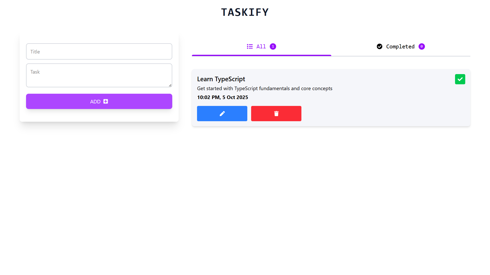

# 📝 React Taskify



A modern, minimal, and responsive To-Do List App built with React, TypeScript, and Tailwind CSS.
Easily add, update, delete, and mark tasks as completed — all managed through sleek tab-based navigation.
Your tasks are auto-saved in LocalStorage, so they persist even after page refresh.

---

## 🚀 Features

- ✨ Add new tasks with ease  
- 🔁 Update existing tasks  
- ❌ Delete tasks you no longer need  
- ✅ Mark tasks as completed  
- 🧭 Switch between tabs to view active and completed tasks  
- 💾 Persistent storage — tasks are saved in browser LocalStorage  
- 🌗 Dark mode ready
- 💅 Built with **React + TypeScript + Tailwind CSS** for a modern workflow  

---

## 🛠️ Tech Stack

- ⚛️ **React + Vite** — blazing fast development setup  
- 💻 **TypeScript** — strong typing for cleaner, safer code  
- 🎨 **Tailwind CSS** — utility-first styling that just works  

---


## 🧩 Getting Started

Ready to get your task life together? Let’s go 👇  


```bash

1️⃣ Clone the repository
git clone https://github.com/abhishek-kumar612/React-taskify.git

2️⃣ Navigate into the project
cd React-taskify

3️⃣ Install dependencies
npm install

4️⃣ Run the development server
npm run dev
```

Now open your browser and head over to:
👉 http://localhost:5173

Have fun and enjoy coding! 🎉